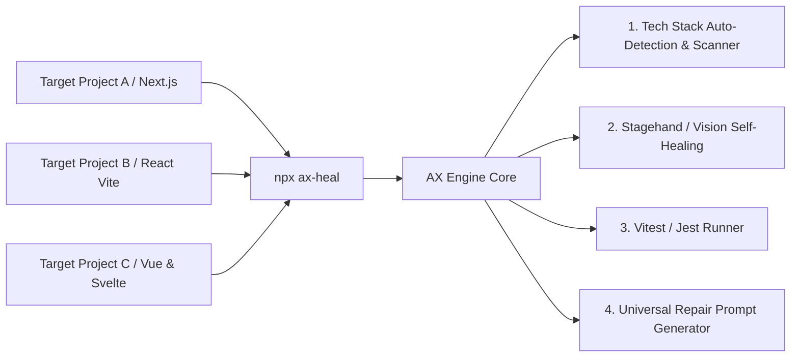
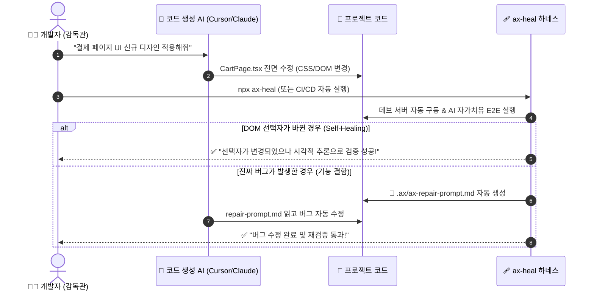

# 🩹 AX-HEAL (`ax-heal-harness`)
> **AI-to-AI 자가치유(Self-Healing) UI 테스트 및 자동 수리(Auto-Repair) 검증 하네스**

`ax-heal`은 기존 Playwright/Cypress처럼 CSS 셀렉터나 ID 변경에 쉽게 깨지던 E2E 테스트의 한계를 극복하기 위해 설계된 **범용 AI 검증 하네스 CLI 패키지**입니다.  
어떤 웹 프로젝트(React, Next.js, Vue, Svelte)에나 붙여서 **자연어 및 비주얼 자가치유 검증**을 수행하고, 버그 발생 시 생성 AI(Cursor/Claude/Gemini)가 바로 읽어 고칠 수 있는 **자동 수리 프롬프트를 배출**합니다.

---

## 🏗️ 1. Reusable AX Harness Architecture



---

## 🔄 2. AI-to-AI Closed-Loop Verification Workflow



---

## 🔥 Key Features

1. **🔍 AI Code Scanner (`npx ax-heal scan`)**:
   - `ax.config.json`을 수동으로 작성할 필요 없이, 프로젝트 소스코드의 버튼, 폼 입력창, 라우트를 스캔하여 테스트 시나리오를 **자동으로 생성**합니다.
2. **🩹 Self-Healing E2E Engine (Stagehand & Vision AI)**:
   - DOM 선택자(`#cart-btn-123`)가 무작위 변경되어도 `"결제 버튼 클릭"`, `"쿠폰 적용"` 문맥과 화면 역할을 인식하여 **스스로 선택자를 치유하면서 동작**합니다.
3. **📡 Dev Server Auto-Spawner**:
   - 로컬 서버(`http://localhost:3000`)가 꺼져 있어도 프로젝트의 `devCommand`(`npm run dev`)를 백그라운드로 자동 구동하고 테스트 후 정리합니다.
4. **📝 Closed-Loop Repair Prompt Generator (`.ax/`)**:
   - 테스트 실패 시 스택 트레이스와 DOM 캡처를 종합하여 생성 AI용 자동 수리 프롬프트(`.ax/ax-repair-prompt.md`) 및 구조화 데이터(`.ax/ax-feedback.json`)를 즉시 생성합니다.

---

## 🚀 Quick Start

### 1. 패키지 설치
```bash
npm install -D ax-heal-harness
```

### 2. AI 소스코드 스캔 및 시나리오 자동 생성
```bash
npx ax-heal scan
```
> 프로젝트의 버튼과 폼 필드를 분석하여 `ax.config.json`을 자동 생성합니다.

### 3. 자가치유 검증 실행
```bash
npx ax-heal
```

---

## ⚙️ Configuration (`ax.config.json`)

```json
{
  "projectName": "My Target Web App",
  "baseURL": "http://localhost:3000",
  "devCommand": "npm run dev",
  "aiProvider": "stagehand",
  "outputDir": "./.ax",
  "scenarios": [
    {
      "name": "Cart & Checkout Flow",
      "steps": [
        "Navigate to http://localhost:3000",
        "Type AX2026 into promo code input",
        "Click Apply Code button",
        "Click Complete Order & Pay button",
        "Assert text Payment Successful! is visible"
      ]
    }
  ]
}
```

---

## 📜 License
MIT License - Created for Agentic Verification (AX) Workflows.
